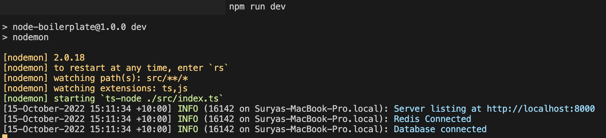
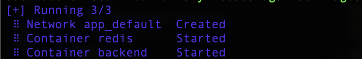
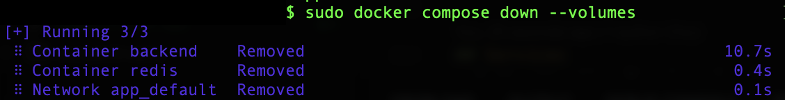

# Gatherly Backend


## About Gatherly

Gatherly is a mobile based application, which helps socially isolated young people to join events and socialise. Gatherly shows events around the user based on their interests and the user can swipe left or right on the events to either skip or join the events. They can also see the event details and the number of participants before joining an event to make sure they are comfortable when attending the events. Gatherly also provides search feature for people that wants to schedule events beforehand.

## Technology Stack

-   Typescript v4.7.4
-   Node.js v16.15.1
-   PostgreSQL
-   Redis
-   Docker
-   Algolia, for search event optimisation
-   AWS S3 Bucket, to store image data

## Folder Structure

```
└── src
   ├── common
   │   ├── config: general configuration
   │   ├── controller: base controller
   │   ├── decorator: custom decorators
   │   ├── dto: common request body definition
   │   ├── entity: common definition of a database table
   │   ├── enum: store the constant value used almost everywhere in the project
   │   ├── exception: custom exceptions
   │   ├── logger: custom logging system
   │   ├── mail: email html file
   │   ├── middleware
   │   ├── payload: payload to create a token
   │   ├── request: base requests interface
   │   ├── response: base responses interface
   │   └── service: base service
   └── service_name
       ├── controller: controller of the service
       ├── dto: request body definition
       ├── entity: definition of a database table
       ├── payload: payload to create a token
       ├── request: requests interface
       ├── response: responses interface
       └── service: handle business logic
```

## Getting Started

### Installation

1. Clone the repo
    ```sh
    git clone https://github.com/deco-freons/be-nodejs.git
    ```
2. Install package dependencies in `package.json`
    ```sh
    npm install
    ```
3. Create `.env` file and write
    ```sh
     ORIGIN=YOUR_ORIGIN
     HOST=YOUR_HOST
     PORT=YOUR_PORT
     DB_HOST=YOUR_DB_HOST
     DB_PORT=YOUR_DB_PORT
     DB_NAME=YOUR_DB_NAME
     DB_USERNAME=YOUR_DB_USERNAME
     DB_PASSWORD=YOUR_DB_PASSWORD
     REDIS_HOST=YOUR_REDIS_HOST
     REDIS_PORT=YOUR_REDIS_PORT
     MAILER_USER=YOUR_ORGANISATION_EMAIL
     MAILER_PASSWORD=YOUR_ORGANISATION_PASSWORD
     SIGN_ACCESS_TOKEN_PRIVATE="YOUR_SIGN_PRIVATE_ACCESS_TOKEN"
     SIGN_ACCESS_TOKEN_PUBLIC="YOUR_SIGN_PUBLIC_ACCESS_TOKEN"
     SIGN_REFRESH_TOKEN_PRIVATE="YOUR_SIGN_PRIVATE_REFRESH_TOKEN"
     SIGN_REFRESH_TOKEN_PUBLIC="YOUR_SIGN_PUBLIC_REFRESH_TOKEN"
     ALGOLIA_APPLICATION_ID=YOUR_ALGOLIA_APPLICATION_ID
     ALGOLIA_ADMIN_KEY=YOUR_ALGOLIA_ADMIN_KEY
     ALGOLIA_SEARCH_KEY=YOUR_ALGOLIA_SEARCH_KEY
     S3_BUCKET_NAME=YOUR_S3_BUCKET_NAME
     S3_ACCESS_KEY_ID=YOUR_S3_ACCESS_KEY_ID
     S3_ACCESS_KEY_SECRET=YOUR_S3_ACCESS_KEY_SECRET
    ```

### Running the Project

1. Make sure the PostgreSQL and Redis are already run in your machine.
2. Run the project
    ```sh
    npm run dev
    ```
    you will see these messages when you have successfully run the project.
    
3. Test the endpoint by using postman, with the URL format
    ```
    http://HOST:PORT
    ```
4. The database table will be automatically generated, then import all of the data on the `/src/data` directory

### Building the Project

1. Make sure the PostgreSQL is already run in your machine
2. Build the project
    ```sh
    docker compose up --build -d
    ```
    It will take several minutes. You will see these messages when you have successfully build the project for production.
    
3. To terminate the project
    ```sh
    docker compose down --volumes
    ```
    you will see these messages when you have terminate the project.
    

## Services

-   Authentication Service: handles user authentication and authorisation, which includes
    -   Registration
    -   Login
    -   Logout
    -   Account Verification
    -   Reset Password
    -   Request New Access Token
    -   Validate Access Token
-   Event Service: handles all of the things related to an event, which includes
    -   Create Event
    -   Read Event
    -   Search Event
    -   Read Event Details
    -   Update Event
    -   Join Event
    -   Cancel or Leave Event
    -   Delete Event
    -   Import Event Data to Algolia
-   Image Service: handles the definition of an image object, which is used for user profile and event image
-   User Service: handles
    -   Read User Profile
    -   Read Other User's Profile
    -   Read Events by The User
    -   Update User Profile
    -   Update or Insert User Preferences

## API Documentation

All of the APIs are documented using Postman Documentation, which can be access [here](https://documenter.getpostman.com/view/11990089/2s8479zwn3).
